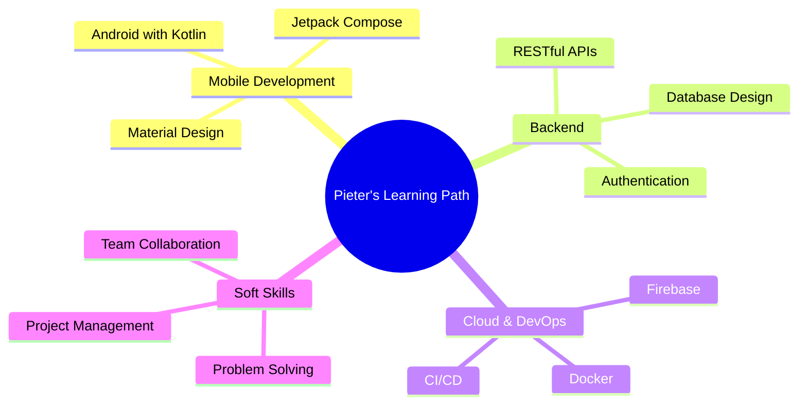

<div align="center">
  
  
  <h3>🎓 Universitas Sumatera Utara — Graduated | Medan, Indonesia</h3>
  
  <p>
    
    
    
  </p>
</div>

<br/>

## 🚀 About Me

```kotlin
class Developer {
    val name = "Pieter Tanoto"
    val location = "Medan, Indonesia 🇮🇩"
    val education = "B.Sc. Computer Science — Universitas Sumatera Utara (Graduated)"
    
    val currentlyLearning = listOf(
        "Android Development with Kotlin",
        "Machine Learning & AI",
        "Cloud Computing",
        "System Design"
    )
    
    val techStack = mapOf(
        "languages" to listOf("Kotlin", "Python", "C++", "Java", "PHP"),
        "mobile" to listOf("Android", "Jetpack Compose"),
        "database" to listOf("MySQL", "SQLite", "Firebase"),
        "tools" to listOf("Git", "Docker", "Android Studio", "VS Code")
    )
    
    fun getGoal() = "Building impactful solutions through code 💡"
}
```

<br/>

## 💼 What I'm Up To

- 🔭 Working on mobile applications and backend systems
- 🌱 Deepening my knowledge in **Android Development** & **System Architecture**
- 👯 Open to collaborate on **Open Source Projects**
- 💬 Ask me about **Android, Kotlin, Python, or C++**
- 📫 Reach me at: **pietertanoto01@gmail.com**
- ⚡ Fun fact: **Code is poetry, but debugging is detective work 🕵️**

<br/>

## 🌐 Connect With Me

<div align="center">
  
[](https://instagram.com/piers_tno)
[](https://www.linkedin.com/in/pieter-tanoto/)
[](https://www.youtube.com/@-PieterTanotoIlmuKomputer)
[](mailto:pietertanoto01@gmail.com)
[](https://stackoverflow.com/users/22934296)
[](https://www.hackerrank.com/profile/pieter037)

</div>

<br/>

## 🛠️ Tech Stack

### Languages


### Frontend


### Mobile Development


### Database


### Tools & IDEs


<br/>

## 📊 GitHub Analytics

<div align="center">
  
  
</div>

<div align="center">
  
</div>

<br/>

## 🏆 GitHub Trophies

<div align="center">
  
</div>

<br/>

## 📈 Contribution Graph

<div align="center">
  
</div>

<br/>

## 🐍 Contribution Snake

<div align="center">
  <picture>
    <source media="(prefers-color-scheme: dark)" srcset="https://raw.githubusercontent.com/PieByter/PieByter/output/github-contribution-grid-snake-dark.svg">
    <source media="(prefers-color-scheme: light)" srcset="https://raw.githubusercontent.com/PieByter/PieByter/output/github-contribution-grid-snake.svg">
    
  </picture>
</div>

<br/>

## 💭 Random Dev Quote

<div align="center">
  
</div>

<br/>

## 🎯 Current Focus



<br/>

---

<div align="center">
  
  
  **✨ Made with ❤️ by Pieter Tanoto**
  
  *Last Updated: 2025*
</div>
